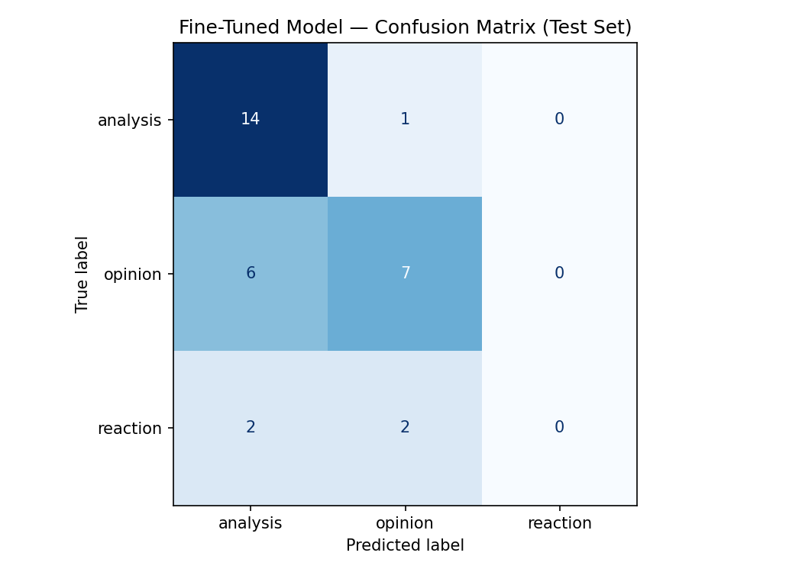

# TakeMeter: r/LetsTalkMusic Discourse Classifier

## Project Overview

TakeMeter is a text classification project that evaluates different types of music discussion in the Reddit community r/LetsTalkMusic. The goal was to build a classifier that distinguishes between detailed musical analysis, personal opinions, and short emotional reactions.

The project includes a labeled dataset, a fine-tuned DistilBERT classifier, a zero-shot Groq baseline, and an evaluation of where the classifier succeeds and fails.

## Community Choice

I chose the r/LetsTalkMusic community because its discussions contain a wide range of music-related discourse. Some users provide detailed arguments about albums, artists, production, and genres, while others share personal opinions or short reactions.

This range made the community a useful setting for studying whether a text classifier could distinguish between different levels and styles of musical discussion.

## Label Taxonomy

### Analysis

A post or comment that makes a reasoned argument about music and supports the argument with specific details, examples, comparisons, or evidence.

Examples:

- "The album's production feels more cohesive because the drums and bass are mixed more clearly than on their previous release."
- "The artist's shift toward electronic production reflects the influence of synth-pop that can also be heard throughout their earlier work."

### Opinion

A post or comment that expresses a personal judgment or viewpoint about music and may provide some explanation, but does not develop a detailed argument.

Examples:

- "I think this is their best album because the songs feel much more consistent."
- "This artist is talented, but I prefer the sound of their earlier albums."

### Reaction

A post or comment that primarily expresses an immediate feeling, preference, praise, dislike, or emotional response with little to no reasoning.

Examples:

- "This album is amazing!"
- "I can't stand this song."

### Decision Rule

The hardest boundary was between `analysis` and `opinion`.

If a post develops its claim using specific evidence, examples, comparisons, or detailed reasoning, it is labeled `analysis`.

If it mainly expresses a personal judgment with only a brief explanation, it is labeled `opinion`.

If it primarily expresses an emotional response with little or no explanation, it is labeled `reaction`.

## Data Collection and Annotation

The data came from the public MusicSem dataset on Hugging Face. I filtered the dataset to include only entries from the `letstalkmusic` thread.

I initially collected 250 examples. During annotation, some entries were mainly discussion prompts or questions that did not clearly fit the three labels, so those entries were temporarily marked as `skip` and removed from the final dataset.

Additional examples were collected so that the final reviewed dataset contained at least 200 usable examples.

The final dataset contains **210 examples**:

| Label | Count |
|---|---:|
| Analysis | 99 |
| Opinion | 84 |
| Reaction | 27 |
| **Total** | **210** |

AI-assisted pre-labeling was used to speed up the annotation process. I personally reviewed the final examples in Google Sheets and corrected labels where necessary before training the model.

The final dataset is available in [`takemeter_final.csv`](takemeter_final.csv).

## Difficult Annotation Decisions

One difficult case was a post discussing several short Jethro Tull songs and briefly describing them as acoustic and guitar-based. Although the post contained specific examples, I labeled it `opinion` because the examples supported only a brief personal observation rather than a developed argument.

Another difficult example discussed an album the writer enjoyed even though it was disliked by some "true fans" of the band. I labeled it `opinion` because the main purpose of the post was expressing personal preference, even though a specific album and artist were mentioned.

A third difficult example expressed interest in reading about the backstories and origins of bands and asked for recommendations. I classified it as `opinion` because it primarily communicated a personal interest rather than presenting a developed musical argument.

## Data Split

The dataset was divided using a stratified 70/15/15 split:

| Split | Examples |
|---|---:|
| Training | 147 |
| Validation | 31 |
| Test | 32 |

The locked test set contained:

- 15 analysis examples
- 13 opinion examples
- 4 reaction examples

## Fine-Tuning Approach

The fine-tuned model used `distilbert-base-uncased` with a three-class sequence classification head.

Training configuration:

- Epochs: 3
- Learning rate: `2e-5`
- Training batch size: 16
- Evaluation batch size: 32
- Weight decay: 0.01
- Warmup steps: 50
- Evaluation strategy: once per epoch

I kept the starter notebook's recommended three epochs and learning rate because the dataset was relatively small. Increasing the number of epochs could have increased the risk of overfitting.

Validation accuracy increased during training:

| Epoch | Validation Accuracy |
|---|---:|
| 1 | 41.9% |
| 2 | 45.2% |
| 3 | 51.6% |

## Zero-Shot Baseline

The project also evaluated a zero-shot Groq model on the exact same locked test set.

The originally specified Groq model was no longer available, so I used an available replacement model through Groq for the baseline. The model received no task-specific training and classified each test post using only the label definitions in the prompt.

The classification prompt was:

```text
You are classifying posts from the Reddit community r/LetsTalkMusic.

Assign each post to exactly one of the following categories:

analysis: A post or comment that makes a reasoned argument about music and supports the argument with specific details, examples, comparisons, or evidence.

opinion: A post or comment that expresses a personal judgment or viewpoint about music and may provide some explanation, but does not develop a detailed argument.

reaction: A post or comment that primarily expresses an immediate feeling, preference, praise, dislike, or emotional response with little to no reasoning.

Decision rule:
If the post develops its claim using specific evidence, examples, comparisons, or detailed reasoning, choose analysis.
If it mainly expresses a personal judgment with only a brief explanation, choose opinion.
If it primarily expresses an emotional response with little or no explanation, choose reaction.

Output ONLY one of these exact label names:
analysis
opinion
reaction

```

## Evaluation Results

Both models achieved the same overall test accuracy:

| Model | Accuracy |
|---|---:|
| Fine-tuned DistilBERT | 65.6% |
| Zero-shot Groq baseline | 65.6% |

Although the overall accuracy was identical, the models performed differently across individual classes.

### Fine-Tuned DistilBERT

| Label | Precision | Recall | F1 |
|---|---:|---:|---:|
| Analysis | 0.64 | 0.93 | 0.76 |
| Opinion | 0.70 | 0.54 | 0.61 |
| Reaction | 0.00 | 0.00 | 0.00 |
| **Macro Average** | **0.45** | **0.49** | **0.46** |
| **Weighted Average** | **0.58** | **0.66** | **0.60** |

### Zero-Shot Groq Baseline

| Label | Precision | Recall | F1 |
|---|---:|---:|---:|
| Analysis | 0.65 | 0.73 | 0.69 |
| Opinion | 0.73 | 0.62 | 0.67 |
| Reaction | 0.50 | 0.50 | 0.50 |
| **Macro Average** | **0.62** | **0.62** | **0.62** |
| **Weighted Average** | **0.66** | **0.66** | **0.66** |

The two models tied in overall accuracy, but the zero-shot baseline performed more consistently across all three classes. In particular, it successfully recognized some `reaction` examples while the fine-tuned model did not correctly classify any reactions in the test set.

## Confusion Matrix

Rows represent the true label and columns represent the fine-tuned model's prediction.

| True \ Predicted | Analysis | Opinion | Reaction |
|---|---:|---:|---:|
| **Analysis** | 14 | 1 | 0 |
| **Opinion** | 6 | 7 | 0 |
| **Reaction** | 2 | 2 | 0 |



The strongest performance was on `analysis`, where the model correctly classified 14 of 15 examples. The largest weakness was the `reaction` class. The model never predicted `reaction`; two reaction examples were predicted as `analysis` and two were predicted as `opinion`.

## Error Analysis

### Error 1: Opinion Predicted as Analysis

One test post discussed an interest in bands' backstories and origins.

- True label: `opinion`
- Predicted label: `analysis`
- Confidence: approximately 0.41

The model may have interpreted the detailed topic and references to music history as evidence of analysis. However, the post mainly communicated a personal interest and asked for suggestions rather than developing an argument.

### Error 2: Opinion Predicted as Analysis

Another post listed several short Jethro Tull songs and described them as acoustic, guitar-based songs.

- True label: `opinion`
- Predicted label: `analysis`
- Confidence: approximately 0.41

The presence of several specific song examples likely pushed the model toward `analysis`. However, the supporting reasoning remained brief, so the post fit the `opinion` definition more closely.

### Error 3: Opinion Predicted as Analysis

A post discussed an album that the writer liked even though it was disliked by some "true fans."

- True label: `opinion`
- Predicted label: `analysis`
- Confidence: approximately 0.41

The model may have learned that mentioning specific artists or albums is a signal for analysis. In this case, those details were primarily context for expressing a personal preference.

### Error Pattern

A recurring error pattern was the model classifying opinions containing specific musical examples as `analysis`. This suggests the model learned to associate specificity, such as album names, artists, and song examples, with analysis even when the reasoning itself was not detailed.

The model also struggled with `reaction`. Only 27 of the 210 final examples belonged to this class, so it had substantially fewer reaction examples available during training.

## Sample Classifications

| Post | True Label | Predicted | Confidence | Correct? |
|---|---|---|---:|---|
| Albums that did not live up to the hype for you and why you think they disappointed | Opinion | Opinion | 0.41 | Yes |
| What do you think about this potential exploit in the music industry? | Analysis | Analysis | 0.40 | Yes |
| Albums with production so prominent it could be considered an extra member | Analysis | Analysis | 0.41 | Yes |
| Let's Talk: Vampire Weekend - Modern Vampires of the City | Opinion | Analysis | 0.41 | No |
| I love reading about bands' backstories/origins | Opinion | Analysis | 0.41 | No |

The first prediction is reasonable because the post primarily expresses and invites personal judgments about albums, which is consistent with the `opinion` label.

## Reflection

My goal was for the model to distinguish between detailed reasoning, general opinions, and immediate reactions.

The model learned the difference between analysis and opinion to some extent, but it appeared to rely heavily on surface-level signals. Posts containing named albums, artists, songs, or multiple specific examples were often classified as analysis even when the reasoning itself was limited.

The reaction category showed the largest gap between my intended taxonomy and the model's learned behavior. Because reaction examples were underrepresented in the dataset, the fine-tuned model did not learn a strong enough decision boundary for that class.

If I repeated the project, I would collect substantially more reaction examples and add more examples specifically near the boundary between `analysis` and `opinion`.

## Spec Reflection

One helpful part of the project specification was requiring the label taxonomy and decision rules to be defined before training. This forced me to clearly establish the difference between analysis, opinion, and reaction before evaluating the model.

One implementation difference involved the zero-shot baseline. The Groq model originally listed in the project instructions was no longer available when I completed the project, so I used a currently available Groq replacement while maintaining the same zero-shot classification procedure.

The data collection process also required an adjustment. Direct Reddit requests were blocked, so I used the public MusicSem dataset and filtered it specifically to r/LetsTalkMusic entries.

## AI Usage

AI tools were used as assistants during the project, while final annotation and evaluation decisions were reviewed manually.

### Annotation Assistance

I used AI to pre-label examples as `analysis`, `opinion`, or `reaction`. Examples that did not clearly fit the taxonomy were temporarily marked as `skip`.

I personally reviewed the final dataset in Google Sheets and corrected labels where necessary before training. The temporary `skip` category was removed and was not used as a classifier label.

### Label and Edge-Case Stress Testing

I used ChatGPT to help examine borderline examples between `analysis`, `opinion`, and `reaction`, especially cases where an opinion contained specific examples. The AI provided possible classifications, but I applied the decision rules from my planning document and made the final decisions.

### Implementation and Debugging

I used ChatGPT to help troubleshoot the Colab workflow, including API rate limits, model deprecation, dataset persistence, and batch annotation. I revised the generated approach when technical issues occurred rather than using the initial suggestions unchanged.

### Evaluation Analysis

I used AI assistance to identify possible patterns among incorrect predictions. I then reviewed the errors myself and confirmed that a recurring issue was the model confusing `opinion` with `analysis` when specific musical examples were included.

## Project Files

- [`planning.md`](planning.md) - project planning and label-design document
- [`takemeter_final.csv`](takemeter_final.csv) - reviewed labeled dataset
- [`evaluation_results.json`](evaluation_results.json) - exported evaluation results
- [`confusion_matrix.png`](confusion_matrix.png) - fine-tuned model confusion matrix

## Demo Video

**Demo link:** https://drive.google.com/file/d/1i7djSr6Ur5qJQOQQ6xtVbuaRv90uPLcX/view?usp=sharing

The demo includes:

- 3–5 posts classified by the fine-tuned model with predicted label and confidence
- an explanation of one correct prediction
- an explanation of one incorrect prediction
- a brief walkthrough of the evaluation results
